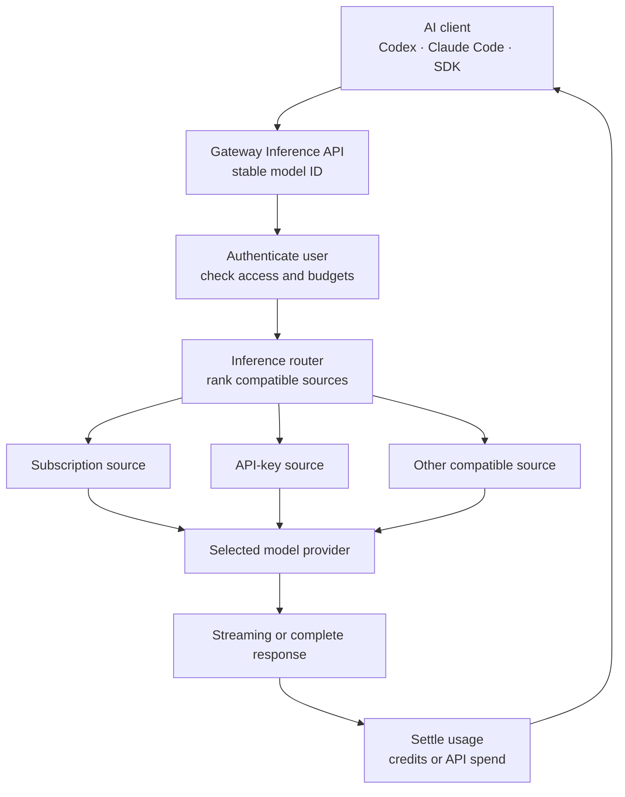

Gateway Inference gives a team one governed endpoint for approved AI models. Administrators connect provider accounts, combine compatible sources behind stable public model IDs, decide who can use each model, and set per-user limits. Users and coding agents receive one Gateway token instead of credentials for every upstream provider.

It is a separate data plane from AI Workspace and remote MCP. AI Workspace is the assistant built into the Gateway interface; MCP exposes infrastructure tools to external agents; Gateway Inference carries model requests and responses for compatible AI clients. Enabling one does not silently enable the others, and their credentials are not interchangeable.

## What Gateway Inference solves

- **One client configuration:** clients keep the same Gateway base URL and public model ID while administrators change compatible upstream sources.
- **Central access control:** published models can be restricted to selected users and groups.
- **Provider isolation:** end users never receive the provider subscription or API credentials.
- **Capacity-aware routing:** Gateway considers connection health, discovered quota, budgets, source compatibility, and current availability before sending a request.
- **Normalized accounting:** subscription capacity becomes credits; API-key usage becomes priced spend; both remain attributable to the Gateway user.
- **Operational evidence:** requests, attempts, selected sources, usage, failures, and terminal state are recorded without putting prompt and response bodies in normal activity logs.

Gateway does not create provider capacity or replace the provider's privacy, availability, residency, or contractual terms. A healthy connection means Gateway can currently use it, not that the provider guarantees future capacity.

## Architecture and request flow



The Gateway application owns users, model publication, permissions, budgets, and visible usage. The supervised inference core owns protocol translation and execution. Provider connections remain external dependencies, and the client owns the prompt, continuation identifiers, and handling of the final response.

## Administrator path

1. Enable Inference in **Settings > General**.
2. Install the supervised inference core and wait until it reports healthy.
3. Add one provider connection and complete its authentication flow.
4. Wait for model and quota discovery; do not publish from stale discovery data.
5. Create a public model and attach one or more protocol-compatible sources.
6. Set context, output, modality, pricing, and subscription multipliers accurately.
7. Configure a default limit policy, then add narrower per-user overrides where needed.
8. Grant `feat:ai:use` only to users or groups that should call Inference.
9. Test one normal request, one stream, one denied model, one exhausted limit, and one safe source failure.

Start with one provider and one non-critical model. Add fallback sources only after proving that their protocol, modalities, context size, tool behavior, and output semantics are compatible.

## User path and client endpoints

Create a dedicated `gwi_` token under **Profile > Authorizations > Inference API tokens**. The token is shown once and belongs to that user.

| Client family | Base URL |
| --- | --- |
| OpenAI-compatible clients | `https://gateway.example.com/api/inference/v1` |
| Anthropic SDK and Claude-compatible clients | `https://gateway.example.com/api/inference` |

Use the public model ID published by the administrator, not an upstream provider model name. The companion Gateway Inference package can configure Codex and Claude Code, maintain their model catalog, and keep the `gwi_` credential outside project files.


## Providers, sources, and public models

A **provider connection** represents one authenticated upstream account or endpoint. Discovery records the models, technical capabilities, and quota information currently reported by that connection.

A **source** connects one discovered provider model to one published Gateway model. A source can override the subscription multiplier when its real capacity cost differs from the model default. Disabling a source removes it from new routing without forcing clients to change the public model ID.

A **published model** is the stable contract exposed to users. It defines the public ID, context and output limits, capabilities, access rules, and compatible sources. Similar upstream names are not enough: two sources are safe alternatives only when their request protocol and user-visible behavior are compatible.

Provider sources normally use one of two accounting modes:

| Source type | What Gateway limits |
| --- | --- |
| Subscription | Rolling credits over enabled 5-hour, 7-day, and 30-day windows |
| API key | Priced usage against a calendar-month USD budget |

Local or privately hosted endpoints still need an explicit pricing and source policy if they participate in budget enforcement. Do not publish a source with unknown capabilities or pricing merely because a health check succeeds.

## Request lifecycle and failover

For each request Gateway:

1. validates the `gwi_` token and resolves its user;
2. resolves the public model and verifies user access;
3. builds an eligible source set from enabled models, sources, connections, protocol compatibility, quota, and budget state;
4. reserves a conservative amount of capacity before contacting a provider;
5. sends the request through the inference core and normalizes streaming, usage, and errors;
6. retries another compatible source only when the failure is classified as retryable and another eligible source exists;
7. settles the reservation with actual provider usage, or a bounded estimate when exact usage never arrives;
8. writes a terminal request state and usage-ledger entry.

Some protocols require source affinity for continuations. Gateway preserves that affinity while it remains valid and clears it when the lifecycle allows a safe retry. Clients must not assume that every failure can move to another provider: invalid input, denied access, an invalid continuation ID, and an exhausted user budget are not capacity failover events.

Streaming and non-streaming requests must reach one terminal state. After a network interruption, inspect the recorded request before submitting a potentially expensive duplicate.

During long silent SSE responses, including compaction, Gateway sends an initial keepalive comment and checks every 15 seconds whether another is needed. Comments are emitted only between complete events and when the consumer can accept data. They are neither model output nor completion events; the real terminal event still controls accounting. This protects the HTTP stream from intermediary idle timeouts.

## Credits and usage accounting

Credits are a normalized measure of subscription-provider consumption. They are not money and are intentionally not identical to raw token totals. Gateway weights token classes and then applies the source's effective multipliers.

### Credit formula

```text
weighted tokens =
  uncached input tokens
  + cached input tokens × 0.10
  + cache-write tokens × 1.25
  + output tokens
  + reasoning tokens

public credits =
  weighted tokens ÷ 1,000,000
  × model multiplier
  × burn multiplier
  × service-tier multiplier
```

At a total multiplier of `1×`, one public credit represents one million weighted tokens.

| Component | Weight | Why it differs |
| --- | ---: | --- |
| Uncached input | `1.00` | Full prompt processing |
| Cached input read | `0.10` | Reusing an existing provider cache is cheaper |
| Cache write | `1.25` | Creating cache state consumes additional capacity |
| Output | `1.00` | Generated tokens count in full |
| Reasoning | `1.00` | Reported reasoning tokens count in full |

The multipliers mean:

- **Model multiplier:** the published model's subscription cost, optionally overridden by a specific source.
- **Burn multiplier:** protects shared subscription capacity when provider quota is being consumed faster than the remaining time allows. It is normally `1×`, can rise dynamically, and is capped at `8×`. Compaction requests use `1×`.
- **Service-tier multiplier:** OpenAI subscription requests using the `Fast`/`priority` tier consume `2×` credits. Other current combinations use `1×`.

The burn multiplier compares remaining subscription quota with remaining time in each discovered provider window. In simplified form:

```text
burn multiplier = min(8, max(
  1,
  time remaining fraction ÷ quota remaining fraction,
  0.30 ÷ quota remaining fraction
))
```

Gateway uses the worst active provider quota window. Missing quota data leaves the multiplier at `1×`; stale, empty, or exhausted discovered quota can force the protective `8×` value.

### Worked example

Suppose one week contains:

- 600 million uncached input tokens;
- 1.5 billion cached input tokens;
- 100 million cache-write tokens;
- 300 million output tokens;
- 50 million reasoning tokens.

The weighted total is:

```text
600M + 1,500M × 0.10 + 100M × 1.25 + 300M + 50M
= 1,225M weighted tokens
```

With a `2×` model multiplier, a `1.25×` burn multiplier, and the normal `1×` service tier:

```text
1,225M ÷ 1M × 2 × 1.25 × 1 = 3,062.5 credits
```

This is why two users with similar raw token totals can consume different credits: cache behavior, model choice, provider quota pressure, and service tier all matter.

### Suggested weekly credit limits

The 7-day limit is a rolling window, not a calendar-week allowance. These values are approximate starting points for one user running coding agents or other long-context workloads:

| Weekly limit | Usage profile | Practical interpretation |
| ---: | --- | --- |
| `2,500` credits | Light | Occasional agent sessions and short daily work |
| `5,000` credits | Regular | Daily development with moderate context and tool use |
| `7,500` credits | Intensive | Frequent long sessions, several repositories, or repeated large-context work |
| `10,000` credits | Heavy | Sustained daily agent use with high context churn |
| `15,000` credits | Extra heavy | Near-continuous power-user or multi-agent workloads |

Treat the table as a policy baseline, not a promise of a fixed number of requests or tokens. Begin with the nearest profile, observe at least one full rolling week, then adjust for the actual model and burn multipliers. Use per-user policies instead of multiplying one shared limit by team size.

### Rolling windows and safety margin

Subscription usage can be limited independently over 5 hours, 7 days, and 30 days. A charge is counted in every enabled window and naturally recovers as ledger entries age out. The UI reports the projected recovery time for each window.

Gateway reserves capacity before sending a request and keeps a safety margin to avoid overrunning the configured limit. Normal admission treats about 95% of an enabled subscription limit as spendable, with a narrow allowance for the final request. Users can therefore see a limit become unavailable slightly before the displayed configured number.

API-key sources do not consume subscription credits. Gateway prices uncached input, cached input, cache writes, output, reasoning, and supported unit charges using the source's current pricing snapshot, then applies the configured monthly USD limit. Reconcile that operational estimate with the provider statement before making financial decisions.

## Usage visibility and administration

Users can see their current Inference usage and recovery windows in **Profile**. The Dashboard can surface low or exhausted windows. Administrators with usage access can inspect system totals, per-user policies, request activity, token classes, credits, API spend, selected models, and terminal status.

Configure system defaults first. A per-user policy can narrow the default but must not silently reopen a dimension disabled globally. Reset usage only for an explicit operational reason; increasing a limit is usually clearer than erasing the history used to explain an incident.

## Privacy and credential boundaries

Gateway does not put prompt or model-output bodies into normal activity records. It stores normalized metadata, token classes, cost, selected source, attempts, errors, and terminal state. The selected provider still receives the request content, so review that provider's retention, training, residency, and data-processing terms before publishing it.

`gwi_` tokens are valid only for Gateway Inference. Browser sessions, `gw_` REST API tokens, `gwo_` OAuth tokens, `gwl_` logging tokens, and MCP authorization cannot be substituted. Use separate tokens for separate clients and revoke a token when its client or owner changes.

Private upstream addresses are denied by default. Allow them only when the administrator intentionally accepts the network trust boundary and has protected the path against server-side request forgery and unintended internal access.

## Failure diagnosis

| Symptom | Check first |
| --- | --- |
| `401` | `gwi_` token exists, is not revoked, and is sent to the Inference base URL |
| Model not found or denied | Public model ID, group access, source enablement, and published capabilities |
| Capacity unavailable | Current discovery, provider quota, connection health, eligible fallback sources |
| Budget exhausted | User 5h/7d/30d credits or API monthly USD limit and recovery time |
| Continuation rejected | Original source affinity, continuation identifier, and provider compatibility |
| Stream stops without completion | Client disconnect, provider terminal event, request attempt state, and reconciliation |
| Usage looks unexpectedly high | Cache classification, model multiplier, dynamic burn multiplier, and `Fast`/priority tier |
| API spend differs from invoice | Pricing snapshot, long-context tier, non-token unit charges, and provider statement |

Inspect inference core health, provider connection state, discovered models and quotas, publication rules, token access, user limits, eligible candidates, and protocol compatibility in that order. Restarting the core is not a substitute for correcting an invalid provider or model contract.

## Rollout and rollback

Introduce one provider and one non-critical model first. Give access to a small group, use conservative weekly limits, and compare Gateway usage with provider capacity or billing. Test both advertised protocols, streaming completion, budget exhaustion, a denied model, revoked tokens, and one safe source failover.

To withdraw a model, stop granting new access, identify clients using its public ID, and provide a tested replacement. If a source becomes unsafe or unavailable, disable that source and verify candidate routing before re-enabling the public model. Do not point an existing public ID at a materially different model merely to keep requests returning `200`.
