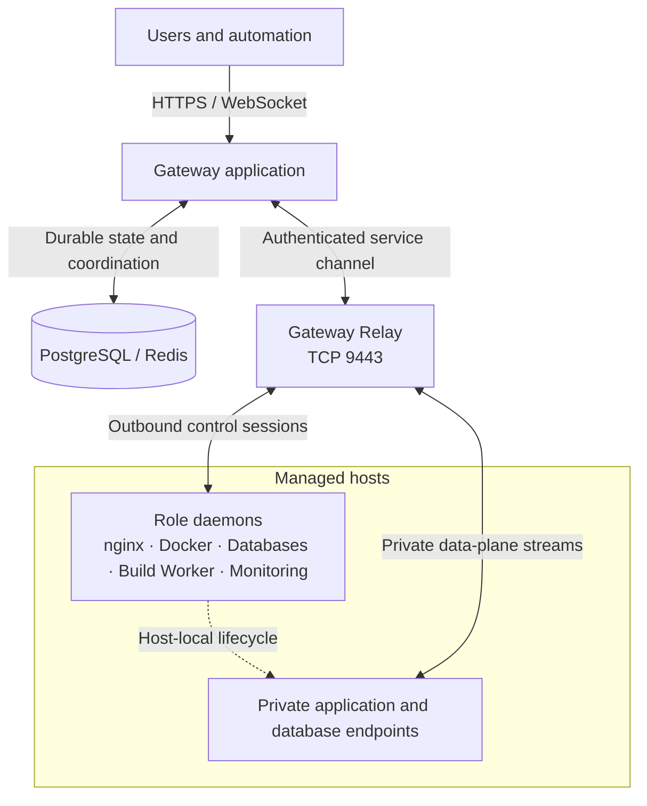

Gateway separates centralized intent and identity from host-local execution.

Private payload moves directly between Relay and host-local application or database endpoints. Gateway authorizes and coordinates those paths, but the Gateway application is not in the payload stream.

## Control plane

The Gateway application is the control plane. It owns users, groups, scopes, resource definitions, desired state, audit records, encrypted integration credentials, long-running operation state, and recovery decisions. PostgreSQL is the durable source of truth for those records. Redis provides required short-lived coordination such as sessions, caches, queues, rate limits, and bounded reservations; it is not a replacement for durable resource state.

Operators and automation submit intent to the control plane through the Operations Console, REST API, OAuth, remote MCP, or AI Workspace. Those entry points share the same backend authorization, validation, plan-entitlement, ownership, and lifecycle checks. Hiding an action in the UI is not the security boundary, and using an API or AI tool does not bypass a product rule.

The control plane does not treat an accepted request as proof that host-local work completed. Mutations that require a daemon are recorded and dispatched as bounded operations. The owning daemon reports progress and observed state, and Gateway exposes durable Tasks, resource status, events, and logs so an operator can verify convergence.

## Relay

The Relay is a required long-lived data-plane service and the sole public owner of `9443/tcp`. Managed daemons connect outbound through authenticated transport; their control interfaces are not normally exposed to the network. The Gateway application keeps its gRPC listener internal and communicates with Relay across an authenticated service boundary.

Relay carries managed-node control traffic and supported private streams. It does not own nginx configuration, containers, databases, builds, or monitoring work on the destination host. It also does not create firewall rules, provide NAT traversal, or act as a general-purpose VPN. Every managed host must be able to reach its assigned Relay endpoint.

If Relay is unavailable, new managed-node operations and new private-link admissions fail closed because identity and authorization cannot be established. Previously applied workloads may continue locally. Existing data-plane sessions may continue only where the protocol and authorization lifecycle permit it; operators must not infer that a green application process means the control path has recovered.

## Managed daemons

Each managed daemon has a bounded role and identity. Ingress, Docker, Databases, Build Worker, Monitoring, and Relay profiles expose different capabilities and trust boundaries. A Docker daemon cannot become a database daemon because a client changes a request, and user lifecycle APIs must not mutate Gateway-owned internal containers.

Daemons report capabilities, inventory, health, metrics, service addresses, and operation results. Gateway uses those reports to decide whether a host can safely perform an action. Installed packages alone do not prove capability: the daemon must report the feature as available and healthy. When a node is offline or its capability report is stale, read-only views may remain available from a sanitized snapshot, but mutations that need current host state are rejected.

The daemon owns execution on its host: for example, nginx applies configuration, Docker manages runtime objects, and a Database Node runs database engines. Gateway owns the durable identity and desired configuration of managed resources. This split lets a workload keep running during a temporary control-plane interruption without allowing the host to invent new authorized state.

## Data plane

Public application traffic is served by Ingress Nodes running nginx. A Domain selects placement, a Route defines traffic behavior, and Gateway distributes certificate material only to Nodes with enabled TLS Routes that require it. The nginx process is therefore part of the data plane, while Domain, Route, certificate, access, and desired-state records remain in the control plane.

Private paths use narrowly defined mechanisms rather than a shared flat network. An nginx-to-workload Secure Link uses a Gateway-owned connector and Relay transport. A managed database binding uses a distinct engine identity and a listener owned by the target Docker daemon on a binding-specific private network. These mechanisms have separate ownership and diagnostics even though both provide private connectivity.

Gateway Inference is another separate data plane. A supervised inference core executes provider-facing work and is reached through the Gateway proxy. Published model IDs, provider connections, user limits, accounting, and authorization remain Gateway control-plane concerns.

## Operational boundaries

Use the resource detail page and its durable operation history to determine who owns a failure. A saved desired state with an offline Node points first to host, daemon, time, DNS, certificate identity, or Relay connectivity. A connected Node with an unsuccessful Task points to the role-specific runtime or prerequisite. A healthy runtime with a failing public request points to the Domain, TLS, Route, Secure Link, or application path.

Do not repair an ownership problem by editing implementation children directly. Deployment slots are controlled by their Deployment, Compose-owned containers and networks are controlled by their Compose Project, Route-owned Secure Links follow their Route, and managed database identities follow their binding lifecycle. Direct host changes can create drift that Gateway cannot safely reconcile.

## Failure model

Read views may use sanitized last-known snapshots while a Node is offline. Such data is diagnostic evidence, not current authorization. Mutations remain unavailable whenever Gateway cannot prove ownership, capability, entitlement, or current state.

Desired state and operation records are durable so Gateway can reconcile after application, Relay, daemon, or Node restarts. Recovery should restore the failed owner first, wait for fresh inventory and capability reports, then verify each dependent resource family. Avoid deleting and recreating identities as an initial response: doing so can remove grants, break relationships, or leave the old daemon unable to reconnect safely.

For a path-by-path outage matrix—including the difference between a healthy Relay, a local Relay lost with the Gateway host, and an independent external Relay—see [Availability, compatibility, and limits](/en/operations/availability-compatibility-limits/).
