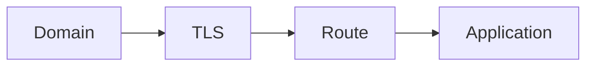
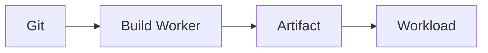
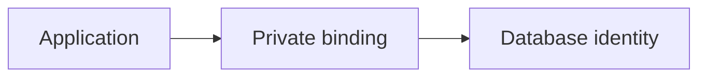
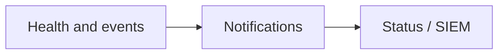

Good Gateway gives your team one place to publish applications, connect private services, operate Docker and databases, manage TLS, and control who can change each resource. Start with the web interface, then automate repeatable work through the Operations Console, REST API, OAuth, or MCP. AI Workspace is available when it helps, but the core platform does not depend on AI.

## Start with a complete workflow

- **Evaluating the product:** start with [Product tour](/en/getting-started/product-tour/), [Architecture](/en/concepts/architecture/), and [Capabilities](/en/reference/capabilities/).
- **Installing a new instance:** follow [Requirements](/en/getting-started/requirements/), [Install Gateway](/en/getting-started/install/), and [Initial setup](/en/getting-started/initial-setup/).
- **Publishing an application:** use the complete [Publish an application](/en/journeys/publish-application/) journey.
- **Connecting an application to a private database:** use [Private application database](/en/journeys/private-database/).
- **Operating production:** read [Production readiness checklist](/en/operations/production-checklist/), [Updates and backups](/en/operations/updates-backups/), and [Incident runbook](/en/operations/incident-runbook/).
- **Integrating tools:** use [Scopes, tokens, and OAuth](/en/identity/scopes-tokens-oauth/) and the programmatic-access reference in the repository operations guide.

## The product model in one minute

Gateway is the control center, while your servers continue to run the actual applications and data services. Managed Nodes connect outbound through Gateway Relay, receive only the operations assigned to their role, and report the real result back. Gateway keeps permissions, resource relationships, operation history, and recovery state in one place.

The most important resource chains are:

<section class="gg-home-diagram">
<h3>Publish an application</h3>

A domain receives HTTPS traffic, and a Route sends each request to the right application.

</section>

<section class="gg-home-diagram">
<h3>Build and deploy from Git</h3>

Gateway turns source code into a versioned artifact and deploys it as a workload.

</section>

<section class="gg-home-diagram">
<h3>Connect an application to a database</h3>

A private binding gives the application its own database identity without exposing the database publicly.

</section>

<section class="gg-home-diagram">
<h3>Turn health signals into alerts</h3>

Gateway turns service health and events into notifications for people, status pages, and SIEM systems.

</section>

## What this documentation includes

This portal combines four kinds of material:

- **Guides:** goal-oriented instructions for configuring a capability.
- **Journeys:** complete happy paths spanning multiple Gateway areas.
- **Runbooks:** operational diagnosis, recovery, updates, and disaster preparation.
- **Reference:** stable terminology, ports, feature status, plans, and security boundaries.

Roadmap-only capabilities are labeled explicitly and must not be treated as available runtime features.

---

This documentation portal and the Good Gateway product site are built from Git and published as immutable deployments with [Good Gateway Pages](/en/journeys/static-site/). The production site therefore exercises the same build, release-tag, preview, and rollback path documented here.
