Good Gateway is an infrastructure control plane for organizations that need a coherent way to operate ingress, Docker workloads, managed databases, certificates, observability, access, automation, and AI services. Use the Operations Console, REST API, OAuth, remote MCP tools, or AI Workspace. AI is an optional operating surface, not a dependency for core infrastructure management.

## Start with a complete workflow

- **Evaluating the product:** start with [Product tour](/en/getting-started/product-tour/), [Architecture](/en/concepts/architecture/), and [Capabilities](/en/reference/capabilities/).
- **Installing a new instance:** follow [Requirements](/en/getting-started/requirements/), [Install Gateway](/en/getting-started/install/), and [Initial setup](/en/getting-started/initial-setup/).
- **Publishing an application:** use the complete [Publish an application](/en/journeys/publish-application/) journey.
- **Connecting an application to a private database:** use [Private application database](/en/journeys/private-database/).
- **Operating production:** read [Production readiness checklist](/en/operations/production-checklist/), [Updates and backups](/en/operations/updates-backups/), and [Incident runbook](/en/operations/incident-runbook/).
- **Integrating tools:** use [Scopes, tokens, and OAuth](/en/identity/scopes-tokens-oauth/) and the programmatic-access reference in the repository operations guide.

## The product model in one minute

Gateway runs as a central application with PostgreSQL and Redis. Managed node daemons connect outbound through the Gateway Relay using authenticated transport. Operators define desired state in Gateway; daemons apply bounded operations on their own hosts. Gateway keeps identity, authorization, audit, resource relationships, and recovery state centrally.

The most important resource chains are:

```mermaid
flowchart TB
    subgraph ingress["Public application path"]
        direction LR
        domain["Domain"] --> certificate["TLS certificate"] --> route["Ingress Route"] --> upstream["Application upstream"]
    end

    subgraph delivery["Software delivery path"]
        direction LR
        repository["Git repository"] --> worker["Build Worker"] --> artifact["Immutable artifact"] --> workload["Docker workload"]
    end

    subgraph database["Private database path"]
        direction LR
        application["Application workload"] --> binding["Managed database binding"] --> identity["Private database identity"]
    end

    subgraph operations["Operational signal path"]
        direction LR
        events["Health and runtime events"] --> notifications["Notifications"] --> consumers["Status pages / SIEM"]
    end
```

## What this documentation includes

This portal combines four kinds of material:

- **Guides:** goal-oriented instructions for configuring a capability.
- **Journeys:** complete happy paths spanning multiple Gateway areas.
- **Runbooks:** operational diagnosis, recovery, updates, and disaster preparation.
- **Reference:** stable terminology, ports, feature status, plans, and security boundaries.

Roadmap-only capabilities are labeled explicitly and must not be treated as available runtime features.

---

This documentation portal and the Good Gateway product site are built from Git and published as immutable deployments with [Good Gateway Pages](/en/journeys/static-site/). The production site therefore exercises the same build, release-tag, preview, and rollback path documented here.
