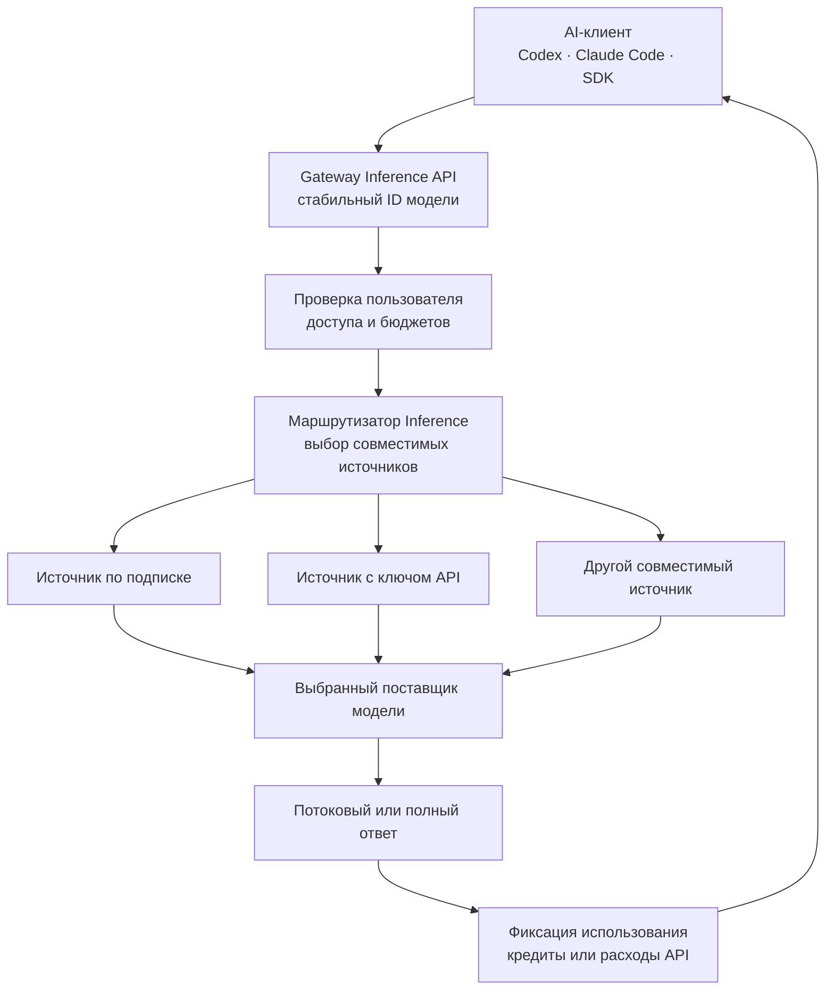

Gateway Inference даёт команде единый управляемый API для одобренных AI-моделей. Администратор подключает учётные записи поставщиков, объединяет совместимые источники под стабильными публичными идентификаторами моделей, определяет доступ и задаёт индивидуальные лимиты. Пользователю или агенту программирования нужен один токен Gateway вместо учётных данных каждого внешнего поставщика.

Это отдельный контур данных, не связанный напрямую с AI Workspace и удалённым MCP. AI Workspace — помощник внутри интерфейса Gateway; MCP предоставляет внешним агентам инструменты управления инфраструктурой; Gateway Inference передаёт запросы и ответы моделей для совместимых AI-клиентов. Включение одного компонента не включает остальные, а их учётные данные не взаимозаменяемы.

## Какие задачи решает Gateway Inference

- **Единая настройка клиента:** базовый адрес Gateway и публичный идентификатор модели не меняются при замене совместимого внешнего источника.
- **Централизованный доступ:** опубликованную модель можно открыть только выбранным пользователям и группам.
- **Изоляция поставщиков:** пользователи не получают ключи API или учётные данные подписок поставщиков.
- **Маршрутизация с учётом ёмкости:** до отправки запроса Gateway учитывает состояние соединения, обнаруженную квоту, бюджеты, совместимость и доступность источника.
- **Единый учёт:** расход подписки выражается в кредитах, использование ключа API — в денежной стоимости; оба показателя относятся к конкретному пользователю Gateway.
- **Эксплуатационные данные:** Gateway сохраняет запросы, попытки, выбранный источник, использование, ошибки и итоговое состояние, не записывая тексты запросов и ответов в обычный журнал активности.

Gateway не создаёт дополнительную ёмкость и не заменяет правила приватности, доступности, размещения данных или договорные условия поставщика. Исправное соединение означает, что Gateway может использовать его сейчас, но не гарантирует будущую ёмкость.

## Архитектура и прохождение запроса



Приложение Gateway управляет пользователями, публикацией моделей, правами, бюджетами и видимым учётом. Контролируемое ядро Inference выполняет преобразование протоколов и запросов. Соединения с поставщиками остаются внешними зависимостями, а клиент отвечает за текст запроса, идентификаторы продолжения и обработку итогового ответа.

## Путь администратора

1. Включите Inference в **Settings > General**.
2. Установите контролируемое ядро Inference и дождитесь исправного состояния.
3. Добавьте одно соединение с поставщиком и завершите его аутентификацию.
4. Дождитесь обнаружения моделей и квот; не публикуйте модель по устаревшим данным.
5. Создайте публичную модель и добавьте к ней один или несколько совместимых источников.
6. Точно задайте размер контекста, вывод, модальности, цену и множители подписки.
7. Настройте лимиты по умолчанию, затем при необходимости добавьте более узкие правила для отдельных пользователей.
8. Выдайте `feat:ai:use` только тем пользователям или группам, которым нужен Inference.
9. Проверьте обычный запрос, потоковый ответ, запрещённую модель, исчерпанный лимит и безопасный отказ одного источника.

Начните с одного поставщика и одной некритичной модели. Добавляйте резервные источники только после проверки протокола, модальностей, размера контекста, работы инструментов и поведения ответов.

## Путь пользователя и адреса клиентов

Создайте отдельный токен `gwi_` в **Profile > Authorizations > Inference API tokens**. Секрет показывается один раз и принадлежит этому пользователю.

| Семейство клиентов | Базовый адрес |
| --- | --- |
| Клиенты, совместимые с OpenAI | `https://gateway.example.com/api/inference/v1` |
| Anthropic SDK и клиенты, совместимые с Claude | `https://gateway.example.com/api/inference` |

Используйте опубликованный администратором публичный идентификатор, а не внутреннее имя модели поставщика. Сопутствующий пакет Gateway Inference может настроить Codex и Claude Code, поддерживать их каталог моделей и хранить токен `gwi_` вне файлов проекта.


## Поставщики, источники и публичные модели

**Соединение с поставщиком** представляет одну аутентифицированную внешнюю учётную запись или адрес. Обнаружение сохраняет модели, технические возможности и сведения о квотах, которые в данный момент сообщает это соединение.

**Источник** связывает обнаруженную модель поставщика с опубликованной моделью Gateway. Источник может переопределить множитель подписки, если его фактический расход ёмкости отличается от значения модели. Отключение источника исключает его из новых запросов, но не требует менять публичный идентификатор в клиентах.

**Опубликованная модель** — стабильный контракт для пользователей. Она задаёт публичный идентификатор, ограничения контекста и вывода, возможности, правила доступа и совместимые источники. Похожие названия недостаточны: источники безопасно заменяют друг друга только при совместимом протоколе запросов и одинаковом пользовательском поведении.

Обычно используются два режима учёта:

| Тип источника | Что ограничивает Gateway |
| --- | --- |
| Подписка | Кредиты в скользящих окнах 5 часов, 7 и 30 дней |
| Ключ API | Рассчитанные расходы в пределах месячного бюджета в долларах США |

Локальным и частным адресам также нужна явная политика цены и типа источника, если они участвуют в ограничении бюджета. Не публикуйте источник с неизвестными возможностями или ценой только потому, что проверка доступности прошла успешно.

## Жизненный цикл запроса и резервные источники

Для каждого запроса Gateway:

1. проверяет токен `gwi_` и определяет пользователя;
2. находит публичную модель и проверяет доступ пользователя;
3. формирует набор доступных источников по состоянию моделей, соединений, совместимости протокола, квот и бюджетов;
4. резервирует консервативно рассчитанную ёмкость до обращения к поставщику;
5. отправляет запрос через ядро Inference и приводит потоковые ответы, использование и ошибки к единому виду;
6. пробует другой совместимый источник только для ошибок, допускающих повтор, и при наличии другого подходящего кандидата;
7. заменяет резерв фактическим использованием поставщика либо ограниченной оценкой, если точные данные не были получены;
8. сохраняет итоговое состояние запроса и запись в журнале использования.

Некоторым протоколам нужна привязка продолжения к исходному источнику. Gateway сохраняет её, пока она действительна, и очищает только тогда, когда правила запроса допускают безопасный повтор. Неверные входные данные, запрет доступа, недействительный идентификатор продолжения и исчерпанный пользовательский бюджет не относятся к сбоям ёмкости и не должны переключаться на другого поставщика.

Потоковый и обычный запрос должны получить одно итоговое состояние. После сетевого разрыва сначала проверьте сохранённый запрос, чтобы не отправить дорогой дубль.

## Кредиты и учёт использования

Кредиты — нормализованная мера расхода поставщика по подписке. Это не деньги и не простая сумма токенов. Gateway взвешивает разные классы токенов, затем применяет действующие множители источника.

### Формула расчёта кредитов

```text
взвешенные токены =
  некэшированные входные токены
  + токены чтения из кэша × 0,10
  + токены записи в кэш × 1,25
  + выходные токены
  + токены рассуждения

публичные кредиты =
  взвешенные токены ÷ 1 000 000
  × множитель модели
  × множитель расхода квоты
  × множитель режима обслуживания
```

При общем множителе `1×` один публичный кредит соответствует одному миллиону взвешенных токенов.

| Составляющая | Вес | Причина отличия |
| --- | ---: | --- |
| Некэшированный ввод | `1,00` | Полная обработка запроса |
| Чтение кэшированного ввода | `0,10` | Повторное использование кэша дешевле |
| Запись в кэш | `1,25` | Создание состояния кэша требует дополнительной ёмкости |
| Вывод | `1,00` | Сгенерированные токены учитываются полностью |
| Рассуждение | `1,00` | Переданные поставщиком токены рассуждения учитываются полностью |

Назначение множителей:

- **Множитель модели** отражает расход подписки опубликованной моделью; отдельный источник может его переопределить.
- **Множитель расхода квоты** защищает общую подписку, если квота поставщика расходуется быстрее, чем проходит её временное окно. Обычно он равен `1×`, может динамически расти и ограничен значением `8×`. Для запросов сжатия контекста используется `1×`.
- **Множитель режима обслуживания** равен `2×` для запросов OpenAI по подписке в режиме `Fast`/`priority`. Для остальных текущих сочетаний применяется `1×`.

Множитель расхода сравнивает остаток квоты подписки с оставшимся временем в каждом обнаруженном окне поставщика. Упрощённая формула:

```text
множитель расхода = min(8, max(
  1,
  доля оставшегося времени ÷ доля оставшейся квоты,
  0,30 ÷ доля оставшейся квоты
))
```

Gateway использует худшее из активных окон квоты. Если данных о квоте нет, сохраняется `1×`; устаревшая, пустая или исчерпанная обнаруженная квота может включить защитное значение `8×`.

### Пример расчёта

Предположим, за неделю пользователь израсходовал:

- 600 миллионов некэшированных входных токенов;
- 1,5 миллиарда кэшированных входных токенов;
- 100 миллионов токенов записи в кэш;
- 300 миллионов выходных токенов;
- 50 миллионов токенов рассуждения.

Взвешенный объём:

```text
600M + 1 500M × 0,10 + 100M × 1,25 + 300M + 50M
= 1 225M взвешенных токенов
```

При множителе модели `2×`, множителе расхода `1,25×` и обычном режиме обслуживания `1×`:

```text
1 225M ÷ 1M × 2 × 1,25 × 1 = 3 062,5 кредита
```

Поэтому пользователи с похожей суммой токенов могут расходовать разное количество кредитов: влияют кэширование, модель, состояние квоты поставщика и режим обслуживания.

### Рекомендуемые недельные лимиты

Лимит на 7 дней действует в скользящем окне, а не обновляется в начале календарной недели. Приблизительные стартовые значения для одного пользователя, который запускает агентов программирования или другие задачи с большим контекстом:

| Недельный лимит | Профиль нагрузки | Практический ориентир |
| ---: | --- | --- |
| `2 500` кредитов | Лёгкий | Периодические сеансы агента и короткая ежедневная работа |
| `5 000` кредитов | Обычный | Ежедневная разработка с умеренным контекстом и инструментами |
| `7 500` кредитов | Интенсивный | Частые длинные сеансы, несколько репозиториев или повторная работа с большим контекстом |
| `10 000` кредитов | Тяжёлый | Постоянное ежедневное использование агентов с частой сменой большого контекста |
| `15 000` кредитов | Очень тяжёлый | Почти непрерывная работа опытного пользователя или нескольких агентов |

Это отправная точка политики, а не обещанное число запросов или токенов. Выберите ближайший профиль, наблюдайте хотя бы одно полное скользящее недельное окно и скорректируйте лимит с учётом фактических множителей модели и расхода. Для команды используйте индивидуальные правила, а не один общий лимит, умноженный на число людей.

### Скользящие окна и запас безопасности

Расход подписки можно независимо ограничить на 5 часов, 7 и 30 дней. Один вызов учитывается во всех включённых окнах, а расход постепенно освобождается по мере устаревания записей. Интерфейс показывает предполагаемое время восстановления каждого окна.

Gateway резервирует ёмкость до отправки запроса и оставляет запас, чтобы не превысить настроенный лимит. Для обычных запросов доступно примерно 95% лимита подписки, а для последнего запроса предусмотрен небольшой дополнительный допуск. Поэтому доступ может закончиться немного раньше отображаемого числового значения.

Источники с ключом API не расходуют кредиты подписки. Gateway рассчитывает стоимость некэшированного и кэшированного ввода, записи в кэш, вывода, рассуждения и поддерживаемых штучных операций по текущему снимку цен, затем применяет месячный лимит в долларах США. Перед финансовыми решениями сверяйте этот эксплуатационный расчёт с отчётом поставщика.

## Просмотр использования и управление лимитами

Пользователь видит своё использование Inference и сроки восстановления окон в **Profile**. Dashboard может предупредить о низком или исчерпанном остатке. Администратор с доступом к учёту видит общие показатели, индивидуальные правила, активность запросов, классы токенов, кредиты, расходы API, выбранные модели и итоговые состояния.

Сначала задайте системные значения по умолчанию. Индивидуальное правило может сузить их, но не должно повторно включать измерение, отключённое глобально. Сбрасывайте использование только по явной эксплуатационной причине: увеличение лимита обычно понятнее, чем удаление истории, необходимой для разбора инцидента.

## Приватность и границы учётных данных

Gateway не записывает тексты запросов и ответы моделей в обычный журнал активности. Он хранит нормализованные метаданные, классы токенов, стоимость, выбранный источник, попытки, ошибки и итоговое состояние. Выбранный поставщик всё равно получает содержимое запроса, поэтому до публикации проверьте его правила хранения, обучения, размещения и обработки данных.

Токены `gwi_` действуют только в Gateway Inference. Их нельзя заменить браузерным сеансом, API-токеном `gw_`, OAuth-токеном `gwo_`, токеном журналирования `gwl_` или авторизацией MCP. Используйте отдельный токен для каждого клиента и отзывайте его при смене клиента или владельца.

Приватные внешние адреса запрещены по умолчанию. Разрешайте их только после осознанного принятия сетевой границы доверия и защиты от обращений сервера к непредусмотренным внутренним ресурсам.

## Диагностика сбоев

| Симптом | Что проверить сначала |
| --- | --- |
| `401` | Токен `gwi_` существует, не отозван и отправляется на базовый адрес Inference |
| Модель не найдена или запрещена | Публичный идентификатор, доступ группы, включение источника и опубликованные возможности |
| Нет доступной ёмкости | Свежесть обнаружения, квоту поставщика, состояние соединения и подходящие резервные источники |
| Исчерпан бюджет | Кредиты пользователя за 5 часов, 7 или 30 дней либо месячный лимит API и время восстановления |
| Продолжение отклонено | Привязку к исходному источнику, идентификатор продолжения и совместимость поставщика |
| Поток оборвался без завершения | Разрыв клиента, итоговое событие поставщика, состояние попытки и согласование учёта |
| Расход кредитов неожиданно велик | Классификацию кэша, множитель модели, динамический множитель расхода и режим `Fast`/`priority` |
| Расходы API отличаются от счёта | Снимок цен, тариф большого контекста, штучные операции и отчёт поставщика |

Проверяйте по порядку: состояние ядра Inference, соединение поставщика, обнаруженные модели и квоты, правила публикации, доступ токена, пользовательские лимиты, подходящих кандидатов и совместимость протокола. Перезапуск ядра не исправит неверные параметры поставщика или несовместимую модель.

## Безопасный запуск и откат

Сначала подключите одного поставщика и одну некритичную модель. Дайте доступ небольшой группе, задайте осторожные недельные лимиты и сравните учёт Gateway с ёмкостью подписки или счётом поставщика. Проверьте оба заявленных протокола, завершение потока, исчерпание бюджета, запрещённую модель, отозванный токен и одно безопасное переключение источника.

Чтобы вывести модель из эксплуатации, прекратите выдавать новый доступ, найдите клиентов её публичного идентификатора и предоставьте проверенную замену. Если источник стал небезопасным или недоступным, отключите его и проверьте выбор кандидатов до повторного включения публичной модели. Не направляйте существующий идентификатор на существенно другую модель только ради успешного HTTP-ответа.
