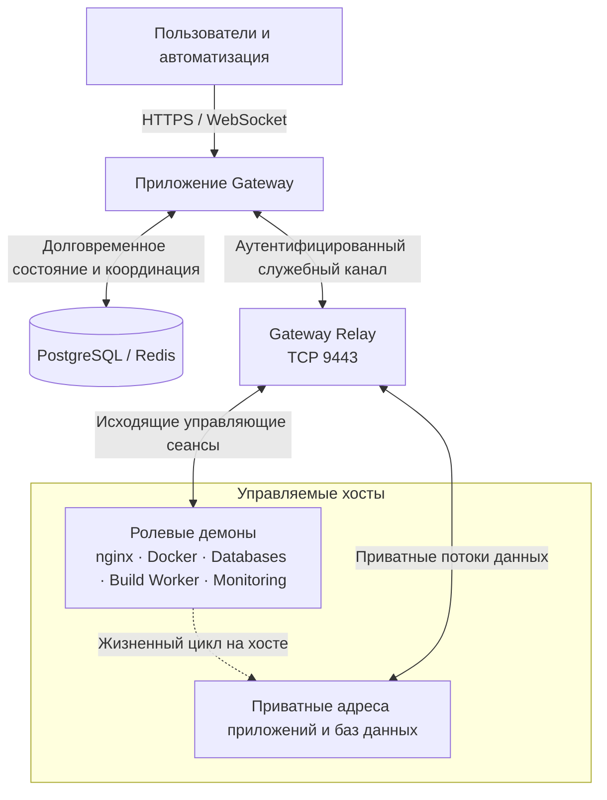

Gateway отделяет централизованное управление, намерения и идентификацию ресурсов от выполнения операций непосредственно на хостах. Благодаря этому вы можете управлять инфраструктурой из одного места, не открывая управляющие интерфейсы хостов в сеть.

Полезная нагрузка передаётся напрямую между Relay и локальными адресами приложений или баз данных. Gateway авторизует и координирует эти пути, но само приложение Gateway не участвует в передаче полезной нагрузки.

## Плоскость управления

Приложение Gateway образует контур управления. В его зоне ответственности находятся пользователи, группы, области доступа, определения ресурсов, желаемое состояние, записи аудита, зашифрованные учётные данные интеграций, состояние длительных операций и решения по восстановлению. PostgreSQL служит долговременным источником истины для этих данных. Redis обеспечивает необходимую кратковременную координацию — сеансы, кэши, очереди, ограничения частоты запросов и ограниченные резервирования, — но не заменяет долговременное состояние ресурсов.

Операторы и системы автоматизации передают свои намерения в контур управления через Operations Console, REST API, OAuth, удалённый MCP или AI Workspace. Все эти точки входа используют одинаковые серверные проверки авторизации, валидации, доступности функций по тарифу, владения и жизненного цикла. Скрытие действия в UI не создаёт границу безопасности, а обращение через API или AI-инструмент не позволяет обойти правила продукта.

Принятый запрос не считается доказательством того, что работа на хосте завершена. Изменения, для которых нужен демон, сохраняются и отправляются как ограниченные операции. Ответственный демон сообщает ход выполнения и наблюдаемое состояние, а Gateway показывает долговременные Tasks, состояние ресурса, события и журналы. По этим данным оператор может подтвердить, что фактическое состояние сошлось с желаемым.

## Relay

Relay — обязательная долговременная служба контура данных и единственный публичный владелец `9443/tcp`. Управляемые демоны устанавливают исходящие соединения через аутентифицированный транспорт; обычно их управляющие интерфейсы не открыты в сеть. Служба приёма gRPC-соединений приложения Gateway остаётся внутренней, а взаимодействие с Relay проходит через аутентифицированную межсервисную границу.

Relay передаёт управляющий трафик управляемых Nodes и поддерживаемые приватные потоки. При этом Relay не отвечает за конфигурацию nginx, Containers, базы данных, сборки или мониторинг на целевом хосте. Он также не создаёт правила межсетевого экрана, не обеспечивает обход NAT и не работает как универсальный VPN. Каждый управляемый хост должен иметь доступ к назначенному адресу Relay.

Если Relay недоступен, новые операции с управляемыми Nodes и новые подключения приватных связей отклоняются по безопасному принципу: Gateway не может подтвердить идентичность и авторизацию. Ранее применённые рабочие нагрузки могут продолжать работать локально. Существующие сеансы контура данных сохраняются только там, где это допускают протокол и жизненный цикл авторизации; работающий процесс приложения сам по себе не означает, что управляющий путь восстановлен.

## Управляемые демоны

У каждого управляемого демона есть ограниченная роль и собственная идентичность. Профили Ingress, Docker, Databases, Build Worker, Monitoring и Relay предоставляют разные возможности и имеют разные границы доверия. Docker-демон не может стать демоном базы данных только потому, что клиент изменил запрос, а пользовательские API жизненного цикла не могут изменять внутренние Containers, принадлежащие Gateway.

Демоны сообщают о доступных возможностях, инвентаре, состоянии, метриках, служебных адресах и результатах операций. На основании этих отчётов Gateway решает, может ли хост безопасно выполнить действие. Одного наличия установленных пакетов недостаточно: демон должен подтвердить, что функция доступна и работоспособна. Если Node отключён или отчёт о возможностях устарел, данные для чтения могут оставаться доступными из очищенного снимка, но изменения, которым требуется актуальное состояние хоста, отклоняются.

Демон отвечает за выполнение на своём хосте: например, nginx применяет конфигурацию, Docker управляет объектами среды выполнения, а Database Node запускает движки баз данных. Gateway отвечает за долговременную идентичность и желаемую конфигурацию управляемых ресурсов. Такое разделение позволяет рабочей нагрузке продолжать работу при временном сбое контура управления, но не позволяет хосту самостоятельно создавать новое авторизованное состояние.

## Плоскость данных

Публичный трафик приложений обслуживают Ingress Nodes с nginx. Domain определяет размещение, Route задаёт поведение трафика, а Gateway передаёт сертификат только тем Nodes, где включены использующие его TLS Routes. Поэтому nginx относится к контура данных, а записи Domain, Route, сертификата, доступа и желаемого состояния остаются в контура управления.

Для приватных путей используются узкие специализированные механизмы, а не единая плоская сеть. Secure Link между nginx и рабочей нагрузкой использует принадлежащий Gateway коннектор и транспорт Relay. Привязка управляемой базы данных использует отдельную идентичность движка и службу приёма соединений, которой управляет целевой Docker-демон в приватной сети конкретной привязки. Оба механизма обеспечивают приватное подключение, но имеют разные зоны ответственности и способы диагностики.

Gateway Inference образует ещё одну отдельную контур данных. Контролируемое ядро вывода обращается к поставщикам и доступно через прокси Gateway. Опубликованные идентификаторы моделей, подключения поставщиков, пользовательские лимиты, учёт и авторизация остаются в зоне ответственности контура управления Gateway.

## Эксплуатационные границы

Чтобы определить ответственный за сбой уровень, начните со страницы ресурса и долговременной истории операций. Сохранённое желаемое состояние при отключённом Node указывает прежде всего на хост, демон, системное время, DNS, идентичность сертификата или соединение с Relay. Подключённый Node с неуспешной Task указывает на среду выполнения или предварительное условие конкретной роли. Работоспособная среда выполнения при неудачном публичном запросе указывает на цепочку Domain, TLS, Route, Secure Link или на само приложение.

Не пытайтесь исправить нарушение владения прямым редактированием внутренних дочерних объектов. Слоты Deployment управляются через Deployment, Containers и сети Compose — через Compose Project, Secure Links конкретного Route следуют за этим Route, а идентичности управляемых баз данных — за жизненным циклом привязки. Прямое изменение на хосте может создать расхождение, которое Gateway не сможет безопасно устранить.

## Модель отказов

Пока Node отключён, представления для чтения могут использовать очищенные снимки последнего известного состояния. Эти данные помогают диагностике, но не подтверждают текущую авторизацию. Изменения остаются недоступными, если Gateway не может доказать владение, наличие нужной возможности, доступность функции по тарифу или актуальное состояние.

Желаемое состояние и записи операций хранятся долговременно, поэтому Gateway может согласовать состояние после перезапуска приложения, Relay, демона или Node. При восстановлении сначала верните в работу ответственный за сбой компонент, дождитесь свежего инвентаря и отчёта о возможностях, затем проверьте каждое семейство зависимых ресурсов. Не удаляйте и не создавайте идентичности заново первым действием: это может отозвать права, нарушить связи или помешать прежнему демону безопасно переподключиться.
