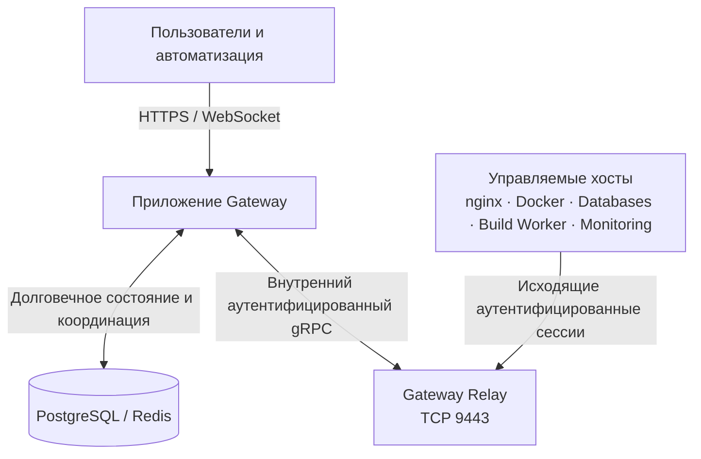

Gateway отделяет централизованные намерения и идентичность от выполнения операций на хостах.

## Плоскость управления

Приложение Gateway — это плоскость управления. Оно владеет пользователями, группами, областями, определениями ресурсов, желаемым состоянием, записями аудита, зашифрованными учётными данными интеграций, состоянием долгих операций и решениями по восстановлению. PostgreSQL служит долговечным источником истины для этих записей. Redis обеспечивает необходимую краткоживущую координацию: сеансы, кэши, очереди, rate limits и ограниченные резервирования; он не заменяет долговечное состояние ресурсов.

Операторы и автоматизация передают намерения плоскости управления через Operations Console, REST API, OAuth, remote MCP или AI Workspace. Эти точки входа используют общие backend-проверки авторизации, валидации, прав по тарифу, владения и жизненного цикла. Скрытое действие в UI не является границей безопасности, а API или AI-инструмент не обходят правила продукта.

Плоскость управления не считает принятый запрос доказательством завершения работы на хосте. Мутации, которым нужен daemon, записываются и отправляются как ограниченные операции. Владеющий daemon сообщает прогресс и наблюдаемое состояние, а Gateway показывает долговечные Tasks, статус ресурса, события и логи, чтобы оператор мог подтвердить схождение.

## Relay

Relay — обязательная долговечная служба плоскости данных и единственный публичный владелец `9443/tcp`. Управляемые daemons подключаются исходящим соединением через аутентифицированный транспорт; их управляющие интерфейсы обычно не открываются в сеть. Приложение Gateway сохраняет свой gRPC listener внутренним и взаимодействует с Relay через аутентифицированную границу служб.

Relay переносит управляющий трафик управляемых Nodes и поддерживаемые приватные потоки. Он не владеет конфигурацией nginx, Containers, базами данных, сборками или мониторингом на целевом хосте. Relay также не создаёт правила firewall, не обеспечивает обход NAT и не является универсальным VPN. Каждый управляемый хост должен достигать назначенного endpoint Relay.

Если Relay недоступен, новые операции с управляемыми Nodes и новые подключения приватных связей завершаются fail-closed, потому что идентичность и авторизацию нельзя подтвердить. Ранее применённые рабочие нагрузки могут продолжать работу локально. Существующие сеансы плоскости данных могут продолжаться только там, где это допускает жизненный цикл протокола и авторизации; работающий процесс приложения не означает, что путь управления восстановился.

## Управляемые демоны

Каждый управляемый daemon имеет ограниченную роль и идентичность. Профили Ingress, Docker, Databases, Build Worker, Monitoring и Relay предоставляют разные capabilities и границы доверия. Docker daemon не может стать daemon базы данных из-за изменения клиентского запроса, а пользовательские API жизненного цикла не должны изменять внутренние Containers, принадлежащие Gateway.

Daemons сообщают capabilities, инвентарь, состояние, метрики, service addresses и результаты операций. Gateway использует эти отчёты, чтобы решить, может ли хост безопасно выполнить действие. Одного наличия пакетов недостаточно: daemon должен сообщить, что функция доступна и исправна. Когда Node отключён или отчёт capabilities устарел, представления только для чтения могут оставаться доступными из очищенного снимка, но мутации, требующие текущего состояния хоста, отклоняются.

Daemon владеет выполнением на своём хосте: например, nginx применяет конфигурацию, Docker управляет runtime-объектами, а Database Node запускает движки баз данных. Gateway владеет долговечной идентичностью и желаемой конфигурацией управляемых ресурсов. Такое разделение позволяет рабочей нагрузке продолжить работу при временном сбое плоскости управления, не разрешая хосту самостоятельно создавать новое авторизованное состояние.

## Плоскость данных

Публичный трафик приложений обслуживают Ingress Nodes с nginx. Domain выбирает размещение, Route определяет поведение трафика, а Gateway распространяет материал сертификата только на Nodes с включёнными TLS Routes, которым он нужен. Поэтому процесс nginx относится к плоскости данных, а записи Domain, Route, сертификата, доступа и желаемого состояния остаются в плоскости управления.

Приватные пути используют узкие специализированные механизмы, а не общую плоскую сеть. Secure Link между nginx и рабочей нагрузкой использует принадлежащий Gateway коннектор и транспорт Relay. Привязка управляемой базы данных использует отдельную идентичность движка и listener, принадлежащий целевому Docker daemon в приватной сети конкретной привязки. У этих механизмов разные владельцы и диагностика, хотя оба предоставляют приватное подключение.

Gateway Inference — ещё одна отдельная плоскость данных. Контролируемое inference core выполняет работу с providers и доступно через proxy Gateway. Опубликованные IDs моделей, подключения providers, пользовательские лимиты, учёт и авторизация остаются задачами плоскости управления Gateway.

## Эксплуатационные границы

Используйте страницу ресурса и долговечную историю операций, чтобы определить владельца сбоя. Сохранённое желаемое состояние при отключённом Node сначала указывает на хост, daemon, время, DNS, идентичность сертификата или соединение с Relay. Подключённый Node с неудачной Task указывает на runtime или предварительное условие конкретной роли. Исправный runtime при неудачном публичном запросе указывает на Domain, TLS, Route, Secure Link или путь приложения.

Не исправляйте проблему владения прямым редактированием дочерних объектов реализации. Слоты Deployment управляются через Deployment, принадлежащие Compose Containers и сети — через Compose Project, принадлежащие Route Secure Links следуют за Route, а идентичности управляемых баз данных — за жизненным циклом привязки. Прямые изменения на хосте могут создать drift, который Gateway не сможет безопасно реконсилировать.

## Модель отказов

Пока Node отключён, представления для чтения могут использовать очищенные снимки последнего известного состояния. Эти данные помогают диагностике, но не являются текущей авторизацией. Мутации остаются недоступными, когда Gateway не может доказать владение, capability, entitlement или текущее состояние.

Желаемое состояние и записи операций сохраняются надёжно, поэтому Gateway может выполнить реконсиляцию после перезапуска приложения, Relay, daemon или Node. При восстановлении сначала верните в работу отказавшего владельца, дождитесь свежего инвентаря и отчёта capabilities, затем проверьте каждое семейство зависимых ресурсов. Не удаляйте и не создавайте идентичности заново как первый шаг: это может снять права, нарушить связи или лишить старый daemon возможности безопасно переподключиться.
