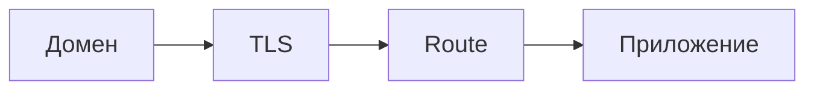
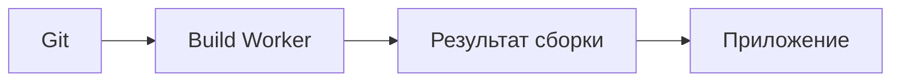
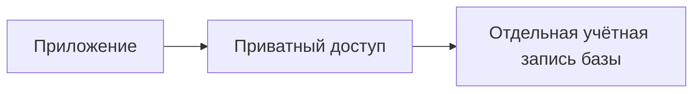
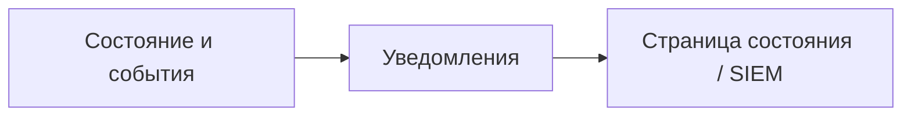

Good Gateway помогает из одного интерфейса публиковать приложения и приватные сервисы, запускать Docker, подключать базы данных, выпускать и обновлять TLS-сертификаты, а также управлять доступом. AI Workspace можно подключить для планирования и выполнения разрешённых действий, но для обычной работы инфраструктуры он не нужен.

## Начните с готового сценария

- **Знакомитесь с продуктом:** начните с [Обзора продукта](/ru/getting-started/product-tour/), затем выберите нужный сценарий ниже.
- **Устанавливаете новый экземпляр:** следуйте [Требованиям](/ru/getting-started/requirements/), [Установке Gateway](/ru/getting-started/install/) и [Первоначальной настройке](/ru/getting-started/initial-setup/).
- **Публикуете приложение:** пройдите полный сценарий [Публикации приложения](/ru/journeys/publish-application/).
- **Подключаете приложение к приватной базе данных:** используйте сценарий [Приватная база данных приложения](/ru/journeys/private-database/).
- **Подготавливаете рабочую среду:** пройдите [чек-лист готовности](/ru/operations/production-checklist/), настройте [обновления и резервное копирование](/ru/operations/updates-backups/) и сохраните [руководство по инцидентам](/ru/operations/incident-runbook/).
- **Интегрируете инструменты:** используйте [Области, токены и OAuth](/ru/identity/scopes-tokens-oauth/) и справочник программного доступа в руководстве по операциям репозитория.

## Модель продукта за минуту

Gateway работает как центральное приложение с PostgreSQL и Redis. На управляемые серверы устанавливаются агенты Node: они сами создают защищённое исходящее соединение через Gateway Relay и выполняют только разрешённые для своей роли операции. Вы задаёте нужную конфигурацию в Gateway, а система хранит пользователей и права, историю изменений, связи между ресурсами и данные для восстановления.

Наиболее важные цепочки ресурсов:

<section class="gg-home-diagram">
<h3>Опубликовать приложение</h3>

Домен принимает HTTPS-трафик, а Route направляет каждый запрос в нужное приложение.

</section>

<section class="gg-home-diagram">
<h3>Собрать и развернуть код из Git</h3>

Gateway собирает исходный код в версионируемый артефакт и разворачивает его как рабочую нагрузку.

</section>

<section class="gg-home-diagram">
<h3>Подключить приложение к базе данных</h3>

Приватное подключение выдаёт приложению отдельную учётную запись, не открывая базу данных в публичную сеть.

</section>

<section class="gg-home-diagram">
<h3>Превратить события в оповещения</h3>

Gateway преобразует состояние сервисов и события в уведомления для команды, страницы состояния и SIEM.

</section>

## Что входит в эту документацию

Этот портал объединяет четыре вида материалов:

- **Руководства:** инструкции, ориентированные на цель и настройку отдельной возможности.
- **Сценарии:** полные успешные пути, охватывающие несколько областей Gateway.
- **Руководства по инцидентам:** диагностика, восстановление, обновления и подготовка к авариям.
- **Справочник:** стабильная терминология, порты, статус функций, планы и границы безопасности.

Возможности из дорожной карты явно помечены: они не считаются доступными, пока не появились в продукте.

---

Этот портал и сайт Good Gateway собираются из Git и публикуются как неизменяемые Deployments через [Good Gateway Pages](/ru/journeys/static-site/). Поэтому они используют тот же путь сборки, проверки, Tag и отката, который описан в документации.
